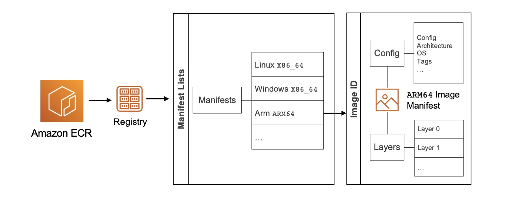

Demo: Multi Architecture Image Builds
====

Multi-architecture container images consist of two main parts: layers and a manifest. Each container image has one or more layers of file system content. The manifest specifies the groups of layers that make up the image as well as its runtime characteristics, either ARM64 and X86_64.

This allows you to have the same repository that supports multiple architectures, and the container runtime does the work of selecting which image layers to pull based on the system architecture, including ARM64. To learn more, visit Introducing multi-architecture container images for Amazon ECR.



Commands
========

## Logging in 

```
export ACCOUNT_ID=$(aws sts get-caller-identity --query 'Account' --output text)

export AWS_REGION=us-east-1

export ECR_URL=$ACCOUNT_ID.dkr.ecr.$AWS_REGION.amazonaws.com

aws ecr get-login-password --region $AWS_REGION | docker login --username AWS --password-stdin $ECR_URL
```

## Using Standard Build 

### Build and push

```
docker build --tag $ECR_URL/mywebapp:arm64 .

docker push $ECR_URL/mywebapp:arm64
```

### Manual Manifest Creation

```
docker manifest create $ECR_URL/mywebapp:latest --amend $ECR_URL/mywebapp:arm64 $ECR_URL/mywebapp:amd64

docker manifest push $ECR_URL/mywebapp:latest
```
### Inspect Manifest

```
docker manifest inspect $ECR_URL/mywebapp:latest
```

----


# Using BuildX

### Build and Push

docker buildx create --name mybuilder
docker buildx use mybuilder
docker buildx build -f buildx.Dockerfile --platform linux/amd64,linux/arm64 -t $ECR_URL/mywebapp:buildx --push .

### Inspect Manifest

docker manifest inspect $ECR_URL/mywebapp:buildx
