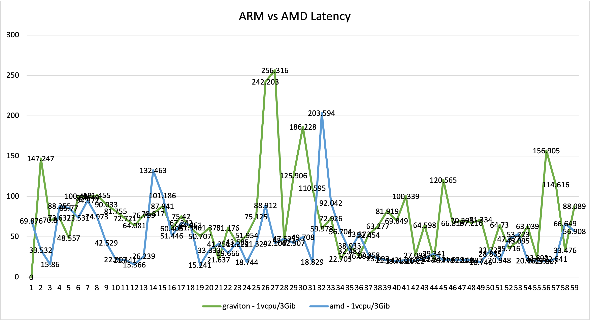

# Performance Comparision between ARM and AMD

| graviton - 1vcpu/3Gib | amd - 1vcpu/3Gib |
|-----------------------|------------------|
| 53.496                | 69.876           |
| 147.247               | 33.532           |
| 70.8                  | 15.86            |
| 73.632                | 88.255           |
| 48.557                | 85.77            |
| 100.487               | 73.531           |
| 98.649                | 94.972           |
| 101.455               | 74.973           |
| 90.033                | 42.529           |
| 81.755                | 22.007           |
| 72.721                | 21.441           |
| 64.081                | 15.366           |
| 76.799                | 26.239           |
| 78.817                | 132.463          |
| 87.941                | 101.186          |
| 60.405                | 51.446           |
| 75.42                 | 67.242           |
| 61.341                | 64.461           |
| 50.707                | 15.241           |
| 61.373                | 33.333           |
| 21.637                | 41.251           |
| 61.176                | 29.666           |
| 41.222                | 43.585           |
| 51.954                | 18.744           |
| 75.125                | 41.329           |
| 242.203               | 88.912           |
| 256.316               | 42.106           |
| 45.571                | 47.525           |
| 125.906               | 42.307           |
| 186.228               | 49.708           |
| 110.595               | 18.829           |
| 59.978                | 203.594          |
| 72.926                | 92.042           |
| 22.703                | 56.704           |
| 38.933                | 32.482           |
| 26.092                | 53.372           |
| 52.454                | 27.358           |
| 63.277                | 23.093           |
| 81.919                | 21.147           |
| 69.849                | 19.759           |
| 100.339               | 21.214           |
| 27.093                | 20.22            |
| 64.598                | 23.31            |
| 22.343                | 29.341           |
| 120.565               | 20.779           |
| 66.813                | 21.623           |
| 70.399                | 21.148           |
| 67.216                | 21.037           |
| 71.334                | 18.746           |
| 28.865                | 33.727           |
| 64.73                 | 20.948           |
| 35.716                | 47.377           |
| 45.095                | 53.223           |
| 63.039                | 20.467           |
| 23.893                | 20.53            |
| 156.905               | 19.807           |
| 114.616               | 22.641           |
| 33.476                | 66.649           |
| 88.089                | 56.908           |